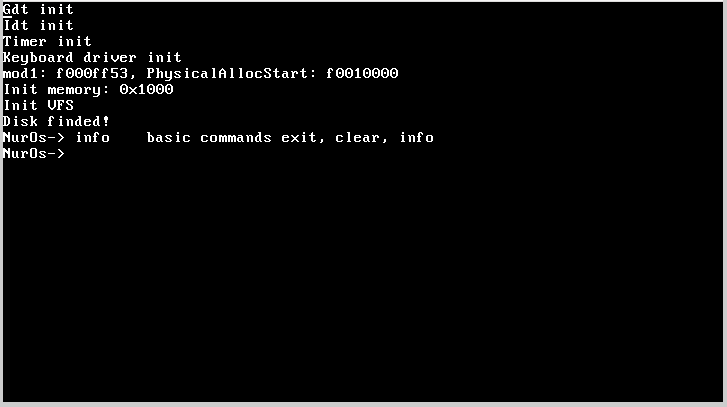

I am a hobby operating system (version 0.98 alpha)

### Features

#### General
- [x] paging
- [x] stdlib
- [x] base SMBIOS

#### Drivers
- [x] disk driver
    - [x] ATA (PIO) disk
    - [ ] ACHI disk
    - [ ] NVME disk
- [x] graphics
    - [x] VGA
    - [ ] VESA
    - [ ] GOP
- [x] PS2 Keyboard driver
- [ ] PS2 Mouse driver

#### Network
- [ ] ...

#### FileSystems
- [x] Virtual FileSystem
- [ ] FAT32 (soon)

#### Bootloader
- [x] GRUB
- [x] Custom Bootloader
- [ ] UEFI Bootloader

